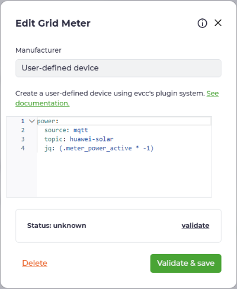
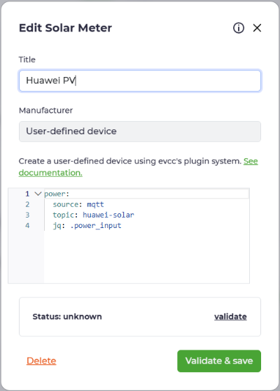
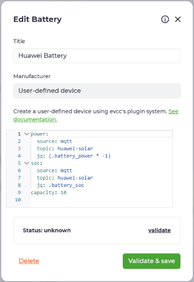
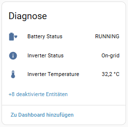
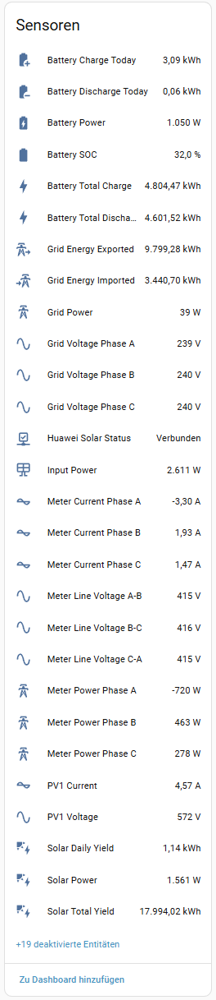
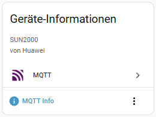

### Huawei Solar Modbus to Home Assistant via MQTT + Auto-Discovery

🇬🇧 **English** | [🇩🇪 Deutsch](README.de.md)

[](https://www.home-assistant.io/)
[](https://github.com/arboeh/huABus/releases/latest)
[](https://github.com/arboeh/huABus/actions)
[](https://codecov.io/gh/arboeh/huABus)
[](https://github.com/arboeh/huABus/blob/main/SECURITY.md)  
[](https://github.com/arboeh/huABus/graphs/commit-activity)
[](https://github.com/arboeh/huABus/blob/main/LICENSE)  
[](https://github.com/arboeh/huABus)
[](https://github.com/arboeh/huABus)
[](https://github.com/arboeh/huABus)
[](https://github.com/arboeh/huABus)
[](https://github.com/arboeh/huABus)

**66 Essential Registers * 67 Entities * Optional MQTT Heartbeat * 30s Polling**  
**Changelog:** [CHANGELOG.md](huawei_solar_modbus_mqtt/CHANGELOG.md)

> **⚠️ IMPORTANT: Single Modbus Connection Limit**
> Huawei inverters allow **only ONE active Modbus TCP connection**.
>
> - ✅ Remove any other Huawei Solar integrations (wlcrs/huawei_solar, HACS, etc.)
> - ✅ Disable monitoring tools and apps with Modbus access
> - ✅ Note: FusionSolar Cloud may show "Abnormal communication" - this is expected

## Features

- **Automatic Slave ID Detection:** Tries common values (1, 2, 100) automatically
- **Modbus TCP → MQTT:** 67 entities with Auto-Discovery
- **Complete Monitoring:** Battery, PV (1-4), Grid (3-phase), Energy counters
- **Total Increasing Filter:** Prevents false counter resets in energy statistics
- **Auto MQTT Configuration:** Automatically uses Home Assistant MQTT credentials
- **Batch Reading (v1.10.1+):** Optional mode for up to 75% faster Modbus cycles with automatic fallback and safer default batching.
- **Performance Diagnostics:** Per-register timing analysis at DEBUG level to identify bottlenecks
- **TRACE Log Level:** Ultra-detailed debugging with Modbus byte arrays
- **Comprehensive Test Suite:** 93% code coverage
- **Performance:** ~2-5s read cycle, configurable poll interval (30-60s recommended)
- **Cross-Platform:** All major architectures (aarch64, amd64, armhf, armv7, i386)
- **Multi Architecture:** Home Assistant add-on builds via explicit `build.yaml` base image mapping

## � Code Flow Overview

The bridge follows a simple cycle:

1. Load the add-on configuration from `/data/options.json` or environment variables.
2. Detect or validate the inverter Modbus slave ID.
3. Connect to MQTT and publish Home Assistant discovery payloads.
4. Open the Modbus TCP session to the inverter.
5. Read the essential register set in batches when enabled.
6. Transform the raw register values into Home Assistant-friendly sensor payloads.
7. Apply the total-increasing filter to avoid false energy resets.
8. Publish the final data to MQTT and sleep until the next polling interval.

The main runtime logic lives in `huawei_solar_modbus_mqtt/bridge/main.py`, while configuration handling is in `huawei_solar_modbus_mqtt/bridge/config_manager.py` and smart register grouping is in `huawei_solar_modbus_mqtt/bridge/batch_builder.py`.

## �🚀 Quick Start

1. [](https://my.home-assistant.io/redirect/supervisor_add_addon_repository/?repository_url=https%3A%2F%2Fgithub.com%2Farboeh%2FhuABus)
2. Install "huABus | Huawei Solar Modbus to MQTT"
3. **Minimal Configuration:**
   ```yaml
   modbus_host: 192.168.1.100
   modbus_auto_detect_slave_id: true
   log_level: INFO
   ```
4. Start the addon → **Settings → Devices & Services → MQTT → "Huawei Solar Inverter"**

## Batch Reading Mode (v1.10.1+)

Groups library-defined register reads into address-based batches instead of reading each individually. Registers present in the supplied specification but not in the library are read directly by address. Automatic fallback to sequential mode is used if batching fails.

**Configuration:**
```yaml
enable_batching: true        # Default: smart batching enabled
batch_max_gap: 50             # Max address gap per batch (recommended: 30-50)
```

**Details:**
- `enable_batching: true` - Groups supported registers by Modbus address proximity to reduce the number of Modbus requests.
- `batch_max_gap: 50` - Maximum address gap (in Modbus units) within a batch. Smaller values create more batches with less risk of exceeding the inverter's internal limit (~125 registers per batch). Larger values reduce batch count but increase the risk of batch failures.
- **Recommended:** `30-50` for most installations. Only increase to `100` if you have a stable, high-performance network.
- Disable (`enable_batching: false`) if you experience repeated batch failures.

## Sensor Defaults

Home Assistant enables the RO/RW sensor entities listed in
[`docs/Huawei_Solar_Inverter_Modbus_Specification.pdf`](docs/Huawei_Solar_Inverter_Modbus_Specification.pdf)
by default. Other discovered sensors remain disabled by default and can be
enabled manually. Write-only commands are not polled.

## EVCC Integration (No Modbus Proxy!)

huABus publishes all data to a single MQTT topic (`huawei-solar`), enabling direct EVCC integration without Modbus proxy or conflicts.

**Requirement:** Activated MQTT in [evcc HA Addon](https://github.com/evcc-io/hassio-addon) (evcc UI → Settings → MQTT)

**Grid Meter:**

```yaml
power:
  source: mqtt
  topic: huawei-solar
  jq: "(.meter_power_active * -1)"
```

**Solar Meter:**

```yaml
power:
  source: mqtt
  topic: huawei-solar
  jq: ".power_input"
```

**Battery (optional):**

```yaml
power:
  source: mqtt
  topic: huawei-solar
  jq: "(.battery_power * -1)"
soc:
  source: mqtt
  topic: huawei-solar
  jq: ".battery_soc"
capacity: 10
```

  
  


## Comparison: wlcrs/huawei_solar vs. This Addon

| Feature                 | wlcrs/huawei_solar<br>(Integration) | This Addon<br>(MQTT Bridge)  |
| ----------------------- | ----------------------------------- | ---------------------------- |
| Battery control         | ✅                                  | ❌ (read-only)               |
| MQTT-native             | ❌                                  | ✅                           |
| Batch reading           | ❌                                  | ✅ (optional, auto fallback) |
| Auto Slave ID detection | ❌                                  | ✅                           |
| Total Increasing filter | ❌                                  | ✅                           |
| External integrations   | Limited                             | ✅ (EVCC, Node-RED, Grafana) |
| Error tracking          | Basic                               | Advanced                     |

Both share the same limitation - only **ONE Modbus connection**. To use both simultaneously, you need a Modbus Proxy.

## Screenshots

  
  


## Configuration

- **Modbus Host:** Inverter IP address (e.g. `192.168.1.100`)
- **Modbus Port:** Default: `502`
- **Auto-detect Slave ID:** Default: `true` (tries 1, 2, 100 automatically)
- **Slave ID (manual):** Only used when auto-detection disabled
- **MQTT Broker:** Default: `core-mosquitto` (leave empty for auto-config)
- **MQTT Port:** Default: `1883`
- **MQTT Username/Password:** Optional (leave empty to use HA MQTT credentials)
- **MQTT Topic:** Default: `huawei-solar`
- **Log Level:** `TRACE` | `DEBUG` | `INFO` (recommended) | `WARNING` | `ERROR`
- **Status Timeout:** Default: `180s`
- **Poll Interval:** Default: `30s` (recommended: 30-60s)

## Troubleshooting

**Multiple Modbus connections** (most common!): Disable all other Huawei integrations and monitoring tools. Only ONE connection allowed.

**All Slave IDs fail:** Enable Modbus TCP in inverter settings, verify IP address, check firewall.

**MQTT Errors:** Set broker to `core-mosquitto`, leave credentials empty.

**Logs:** Addon → Huawei Solar Modbus to MQTT → Log Tab  
**Debug Mode:** Set `log_level: DEBUG`

## Latest Updates
See [CHANGELOG.md](huawei_solar_modbus_mqtt/CHANGELOG.md) for detailed release notes.

- **v1.11.0:** Library upgrade to huawei-solar 3.0.7 (tModbus transport), Python >=3.12, narrowed exception handling to READ_EXCEPTIONS, `get_error_tracker()` accessor, test coverage 93.23% → 93.33%, SECURITY.md updated (supported versions, 93% coverage), dependency changes (removed pymodbus/backoff/pytz, added tmodbus/serialx/tenacity)
- ✅ **v1.10.4:** Modbus connection timeout on setup_modbus(), narrowed exception handlers in run_main_cycle to explicit RECOVERABLE_EXCEPTIONS, typed ErrorType in error tracker


## Credits

**Based on:** [mjaschen/huawei-solar-modbus-to-mqtt](https://github.com/mjaschen/huawei-solar-modbus-to-mqtt)  
**Uses library:** [wlcrs/huawei-solar-lib](https://github.com/wlcrs/huawei-solar-lib)  
**Developed by:** [arboeh](https://github.com/arboeh) | **License:** MIT
