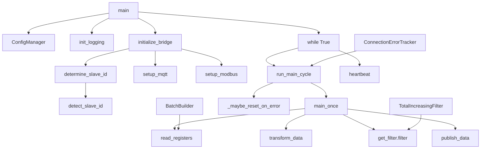
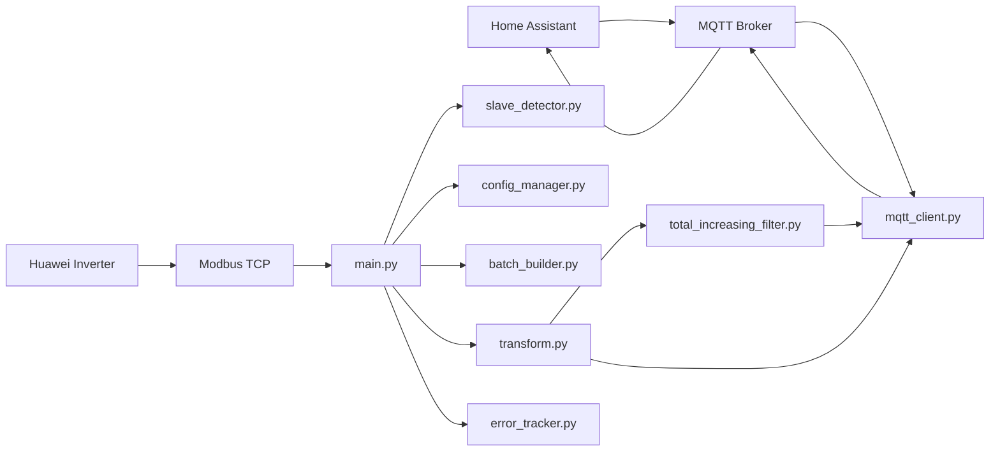

# Huawei Solar Modbus MQTT Bridge Architecture

## System Explanation

This system is a small data pipeline that connects to a Huawei inverter, reads operational values over Modbus TCP, cleans and normalizes them, and sends the final payload to MQTT for Home Assistant.

In plain terms, the software acts like a translator between the inverter's raw Modbus register values and the Home Assistant sensor model. The inverter speaks Modbus; Home Assistant speaks MQTT and discovery payloads; this project sits in the middle and keeps both sides synchronized.

The flow is intentionally simple:

1. Load configuration from the add-on settings or environment variables.
2. Detect the correct inverter Modbus slave ID.
3. Connect to the MQTT broker and publish discovery metadata for all sensors.
4. Open the Modbus connection to the inverter.
5. Read the required registers for PV, grid, battery, and energy counters.
6. Convert raw register values into clean sensor values.
7. Filter false resets and invalid values.
8. Publish the final JSON payload to the configured MQTT topic.
9. Sleep until the next poll interval and repeat.

This is why the project is structured around a few clear responsibilities: configuration, Modbus detection, MQTT publishing, transformation, filtering, and recovery handling.

## Files + Imports

The project is divided into a small set of bridge modules with a clear import direction:

- [huawei_solar_modbus_mqtt/bridge/main.py](../huawei_solar_modbus_mqtt/bridge/main.py) is the orchestration layer and imports the runtime dependencies.
- [huawei_solar_modbus_mqtt/bridge/config_manager.py](../huawei_solar_modbus_mqtt/bridge/config_manager.py) loads and validates configuration.
- [huawei_solar_modbus_mqtt/bridge/slave_detector.py](../huawei_solar_modbus_mqtt/bridge/slave_detector.py) detects the Modbus slave ID.
- [huawei_solar_modbus_mqtt/bridge/mqtt_client.py](../huawei_solar_modbus_mqtt/bridge/mqtt_client.py) manages the persistent MQTT connection and discovery payloads.
- [huawei_solar_modbus_mqtt/bridge/transform.py](../huawei_solar_modbus_mqtt/bridge/transform.py) maps raw Modbus values to final sensor keys.
- [huawei_solar_modbus_mqtt/bridge/total_increasing_filter.py](../huawei_solar_modbus_mqtt/bridge/total_increasing_filter.py) protects cumulative counters from false resets.
- [huawei_solar_modbus_mqtt/bridge/batch_builder.py](../huawei_solar_modbus_mqtt/bridge/batch_builder.py) groups registers into efficient Modbus batches.
- [huawei_solar_modbus_mqtt/bridge/error_tracker.py](../huawei_solar_modbus_mqtt/bridge/error_tracker.py) reduces log spam and tracks outages.

The import direction is mostly top-down: startup code imports helpers, and helper modules do not usually import the top-level application loop.

## Module Dependency Tree

```text
huawei_solar_modbus_mqtt/
├── bridge/
│   ├── __main__.py
│   ├── main.py
│   │   ├── imports ConfigManager
│   │   ├── imports BatchBuilder
│   │   ├── imports detect_slave_id
│   │   ├── imports MQTT publish functions
│   │   ├── imports get_filter / reset_filter
│   │   └── imports transform_data
│   │
│   ├── config_manager.py
│   │   └── imports BatchBuilder
│   │
│   ├── slave_detector.py
│   │   └── imports huawei_solar.create_tcp_client
│   │
│   ├── mqtt_client.py
│   │   ├── imports paho.mqtt.client
│   │   └── imports sensor definitions from config/sensors_mqtt.py
│   │
│   ├── transform.py
│   │   └── imports mapping data from config/mappings.py
│   │
│   ├── total_increasing_filter.py
│   │   └── no imports from main; singleton used by main
│   │
│   ├── batch_builder.py
│   │   └── imports huawei_solar register metadata
│   │
│   ├── error_tracker.py
│   │   └── no external runtime dependency
│   │
│   └── config/
│       ├── mappings.py
│       ├── registers.py
│       └── sensors_mqtt.py
```

## Functions Calling Each Other

The key function relationships are:

- `main()` starts the whole application
- `initialize_bridge()` calls `determine_slave_id()`
- `determine_slave_id()` may call `detect_slave_id()`
- `initialize_bridge()` calls `setup_mqtt()` and `setup_modbus()`
- `run_main_cycle()` calls `main_once()`
- `main_once()` calls `read_registers()`
- `main_once()` calls `transform_data()`
- `main_once()` calls `get_filter().filter()`
- `main_once()` calls `publish_data()`
- `run_main_cycle()` calls `_maybe_reset_on_error()` on recoverable failure
- `heartbeat()` runs in the loop to monitor offline/online status

The logic is intentionally layered: orchestration at the top, protocol and transformation helpers below it.

## Call Graph



## Parameters Flowing Between Functions

A simple parameter chain shows how values move through the system:

- `ConfigManager` produces configuration objects such as `modbus_host`, `mqtt_topic`, `poll_interval`, and `enable_batching`.
- `main()` receives the loaded configuration and passes it into `initialize_bridge(config)`.
- `initialize_bridge(config)` passes the same config into `determine_slave_id(config)`, `setup_mqtt(config)`, and `setup_modbus(slave_id, config)`.
- `setup_modbus(slave_id, config)` creates the actual Modbus TCP client for that unit ID.
- `main_once(client, config, cycle_num)` receives the connected client and current runtime context.
- `main_once()` calls `read_registers(client, batch_max_gap, enable_batching)`.
- The raw Modbus dictionary is forwarded to `transform_data(data)`.
- The transformed result is then sent to `get_filter().filter(transformed)`.
- The filtered payload is published via `publish_data(mqtt_data, config.mqtt_topic)`.
- Status and recovery information are sent via `publish_status(status, topic)` and tracked by `ConnectionErrorTracker`.

This makes it easy to trace the lifecycle of one poll cycle from startup values to final MQTT output.

## Sequence Diagram

```mermaid
sequenceDiagram
    participant User as Operator / HA
    participant Main as main()
    participant Config as ConfigManager
    participant MQTT as mqtt_client
    participant Modbus as Huawei Inverter
    participant Transform as transform_data
    participant Filter as TotalIncreasingFilter

    User->>Main: Start bridge
    Main->>Config: Load settings
    Config-->>Main: Valid config
    Main->>MQTT: connect_mqtt()
    MQTT-->>Main: Connected
    Main->>Modbus: determine_slave_id()
    Modbus-->>Main: Valid slave ID
    Main->>Modbus: setup_modbus()
    Modbus-->>Main: Connected client

    loop each poll interval
        Main->>Modbus: read_registers()
        Modbus-->>Main: raw data
        Main->>Transform: transform_data(data)
        Transform-->>Main: clean sensor payload
        Main->>Filter: filter(payload)
        Filter-->>Main: filtered payload
        Main->>MQTT: publish_data(payload)
        MQTT-->>Main: ack
        Main->>Main: wait for next cycle
    end
```



## Full Project Architecture

At a high level, the project uses a classic layered architecture:

- Configuration layer: reads and validates add-on or environment settings
- Connection layer: local MQTT and remote Modbus TCP connection handling
- Processing layer: transformation, validation, and filtering of register values
- Publishing layer: discovery and state messages for Home Assistant
- Recovery layer: error tracking, reconnection, and status updates

This separation keeps the code easier to debug, test, and extend than a single monolithic script.

## Architecture Diagram



## Folder + File Hierarchy

```text
huawei_solar_modbus_mqtt/
├── bridge/
│   ├── __init__.py
│   ├── __main__.py
│   ├── main.py
│   ├── config_manager.py
│   ├── error_tracker.py
│   ├── logging_utils.py
│   ├── mqtt_client.py
│   ├── slave_detector.py
│   ├── total_increasing_filter.py
│   ├── transform.py
│   ├── batch_builder.py
│   ├── version.py
│   └── config/
│       ├── __init__.py
│       ├── mappings.py
│       ├── registers.py
│       └── sensors_mqtt.py
├── translations/
│   ├── en.yaml
│   └── de.yaml
├── README.md
├── DOCS.md
├── Dockerfile
├── config.yaml
├── build.yaml
├── requirements.txt
├── run.sh
└── apparmor.txt
```

## Project Structure Tree

```text
.
├── README.md
├── README.de.md
├── LICENSE
├── SECURITY.md
├── repository.yaml
├── pyproject.toml
├── examples/
│   └── mqtt_payload.json
├── images/
├── scripts/
│   ├── check_version_sync.py
│   └── update_version.py
├── tests/
│   ├── conftest.py
│   ├── test_main.py
│   ├── test_transform.py
│   ├── test_mqtt_client.py
│   ├── test_total_increasing_filter.py
│   ├── test_slave_detector.py
│   ├── test_config_manager.py
│   ├── test_error_tracker.py
│   ├── test_integration.py
│   ├── test_e2e.py
│   └── fixtures/
│       ├── mock_inverter.py
│       ├── mock_mqtt_broker.py
│       └── scenarios.yaml
└── huawei_solar_modbus_mqtt/
    └── bridge/
        └── ...
```

## Runtime flow

The bridge is a small asynchronous service that does the following each poll cycle:

1. Loads the configuration from the add-on options file or environment variables.
2. Detects the inverter Modbus slave ID if auto-detection is enabled.
3. Connects to MQTT and publishes Home Assistant discovery data.
4. Opens the Modbus TCP connection to the inverter.
5. Reads the essential registers needed for power, voltage, battery, and energy data.
6. Converts the raw values into HA-friendly sensor payloads.
7. Applies the total-increasing filter to avoid false resets in energy counters.
8. Publishes the final MQTT message and waits until the next poll interval.

## Main components

### bridge/main.py

This file contains the orchestration loop. It is the central runtime entry point and manages startup, reconnection, heartbeat, and shutdown behavior.

Key responsibilities:

- initialize_bridge(): connects to MQTT and Modbus
- determine_slave_id(): chooses the correct inverter slave ID
- main_once(): performs a single read/transform/filter/publish cycle
- run_main_cycle(): catches recoverable errors and schedules the next loop
- main(): runs the long-lived event loop

### bridge/config_manager.py

This module normalizes configuration from Home Assistant add-on settings and environment variables into a consistent object.

It provides properties such as:

- modbus_host / modbus_port
- mqtt_host / mqtt_port / mqtt_topic
- poll_interval / status_timeout
- enable_batching / batch_max_gap

This keeps the rest of the application independent from the original config source.

### bridge/batch_builder.py

The batch builder groups Modbus registers by address proximity so a single Modbus read request can cover multiple registers.

This matters because Modbus requests are faster when grouped, but there are limits:

- maximum read span per request
- address-gap limit used to decide when to start a new batch

The module therefore sorts the registers by Modbus address and splits large groups before sending them to the inverter.

### bridge/transform.py

This module translates the raw Modbus data into the custom sensor schema that is later published to MQTT. It prepares values in the format expected by Home Assistant, including sensor names, units, and discovery metadata.

### bridge/total_increasing_filter.py

Energy counters can occasionally appear to reset due to transient communication problems. This filter suppresses those false resets by keeping the last seen valid value and only accepting strictly increasing values.

## Operational notes

- The project expects only one active Modbus TCP connection to the inverter.
- MQTT discovery keeps Home Assistant auto-discovery in sync with the published entities.
- Recoverable Modbus and connection exceptions trigger a reset of the filter and a short delay before retrying.
- The polling interval is the steady-state loop delay; the runtime checks it after each successful cycle.
